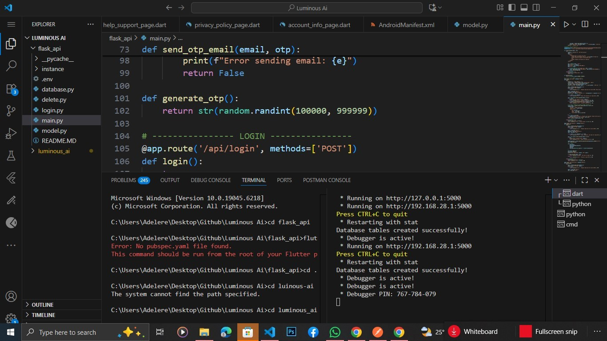

# 🤖 LuminousAi Backend (Flask API)

This is the **Flask backend** for a chatbot application.  
It handles authentication, chat sessions, and communication with the AI model.  
The backend is designed to be linked with a Flutter frontend.

---

## 🚀 Features
- User registration & login with JWT authentication
- Send and receive chatbot messages
- Maintain chat sessions with history
- REST API ready for deployment

---

## 📂 Project Structure
flask_api/
│── app.py # Main Flask application
│── models.py # Database models
│── routes/ # API route handlers
│── requirements.txt # Dependencies
│── Procfile # For deployment (Render/Heroku)
│── README.md # Project documentation


## 🛠️ Installation (Local Setup)

1. **Clone the repository**
   ```bash
   git clone https://github.com/AdelereKehinde/Flask_chatBot_api.git
   cd chatbot-backend
Create a virtual environment

bash
Copy code
python -m venv venv
source venv/bin/activate   # Linux/Mac
venv\Scripts\activate      # Windows
Install dependencies

bash
Copy code
pip install -r requirements.txt
Set environment variables
Create a .env file and add:

env
Copy code
FLASK_APP=main.py
FLASK_ENV=development
SECRET_KEY=your_secret_key
DATABASE_URL=sqlite:///luminous-ai.db
Run the app

bash
Copy code
flask run
The API will be available at:

cpp
Copy code
http://127.0.0.1:5000
📡 API Endpoints
Authentication
POST /api/register → Register new user

POST /api/login → Login and get JWT token

Chat
POST /api/chat → Send a message and get chatbot reply

GET /api/chats → Get all chats

GET /api/chat/<chat_id> → Get specific chat history

🔄 Committing Changes
Check status

bash
Copy code
git status
Stage changes

bash
Copy code
git add .
Commit changes

bash
Copy code
git commit -m "Updated chat API with error handling"
Push to GitHub

bash
Copy code
git push origin main
🚀 Deployment (Render/Heroku)
requirements.txt
Generate/update dependencies:

bash
Copy code
pip freeze > requirements.txt
Procfile
Create a file named Procfile:

makefile
Copy code
web: gunicorn app:app
Push to GitHub and connect to Render/Heroku.

Deploy — your API will be live at:

arduino
Copy code
https://yourapp.onrender.com
📱 Connecting Flutter Frontend
In Flutter, update your API base URL in ChatProvider:

dart
Copy code
final response = await http.post(
  Uri.parse('https://yourapp.onrender.com/api/chat'),
  ...
);
👨‍💻 Author
Developed by Your Name

Email: your.email@example.com

📜 License
This project is licensed under the MIT License.

yaml
Copy code


---

⚡ With this `README.md`, anyone can:
- Install locally  
- Run the backend  
- Deploy online  
- Connect with the Flutter frontend  
